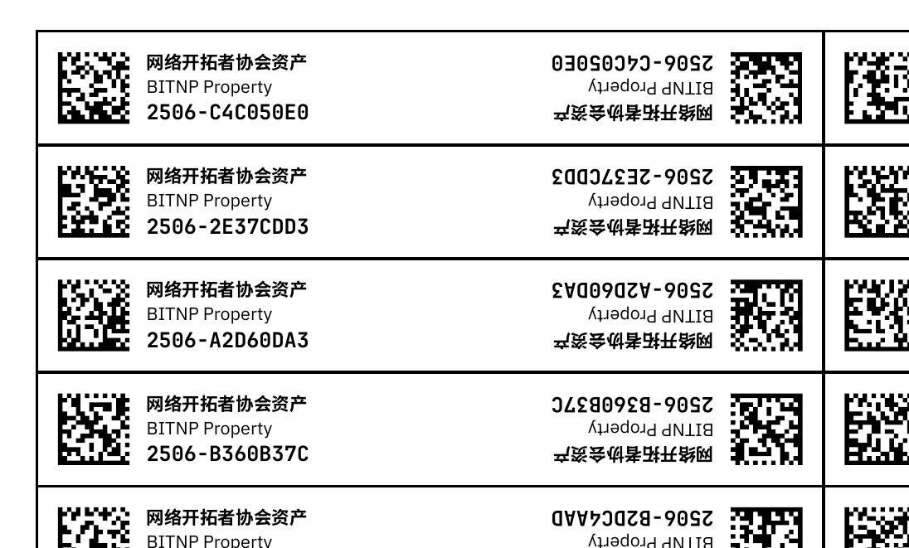

# bitnp-property-label

生成资产标签的工具，可以生成带有二维码的标签，支持单面和双面打印模式。



## 功能特性

- 生成唯一的资产ID（格式：YYMM-XXXXXXXX）
- 自动生成 DataGrid 二维码，便于飞书中登记入库
- 支持单面和双面标签打印
- 基于 Typst 排版系统，生成高质量 PDF 便于打印

## 前置要求

- Bash shell
- [Typst](https://typst.app/)
- `sha1sum` 命令（通常在Linux系统中预装）

## 安装Typst

```bash
# 在有 Rust 的环境的前提下
cargo install --locked typst-cli

# For NixOS Users
nix-shell -p typst
```

## 使用方法

### 按页数生成 (推荐)

```bash
# 生成1页单面标签
./generate.sh --page 1 --single

# 生成2页双面标签
./generate.sh --page 2 --double
```

### 基本用法

```bash
# 生成指定数量的标签（单面模式）
./generate.sh -c 50

# 生成指定数量的标签（双面模式）
./generate.sh -c 25 --double
```

### 命令行选项

- `-c, --count <数量>`: 指定要生成的标签数量
- `--page <页数>`: 按页数生成标签
- `--single`: 单面模式（默认，每页 112 个标签）
- `--double`: 双面模式（每页 42 个标签）
- `-h, --help`: 显示帮助信息

## 标签规格

### 单面标签

- 每页：112 个标签
- 排列：8 列 × 14 行
- 纸张：A4 横向

### 双面标签  

- 每页：42 个标签
- 排列：3 列 × 14 行
- 纸张：A4 横向
- 特点：左右两侧为相同内容，方便对折使用

## 注意事项

1. 确保脚本有执行权限：`chmod +x generate.sh idgen.sh`
2. 生成的ID基于时间戳，确保系统时间正确
3. 双面标签设计用于对折粘贴，可提供更好的耐用性
